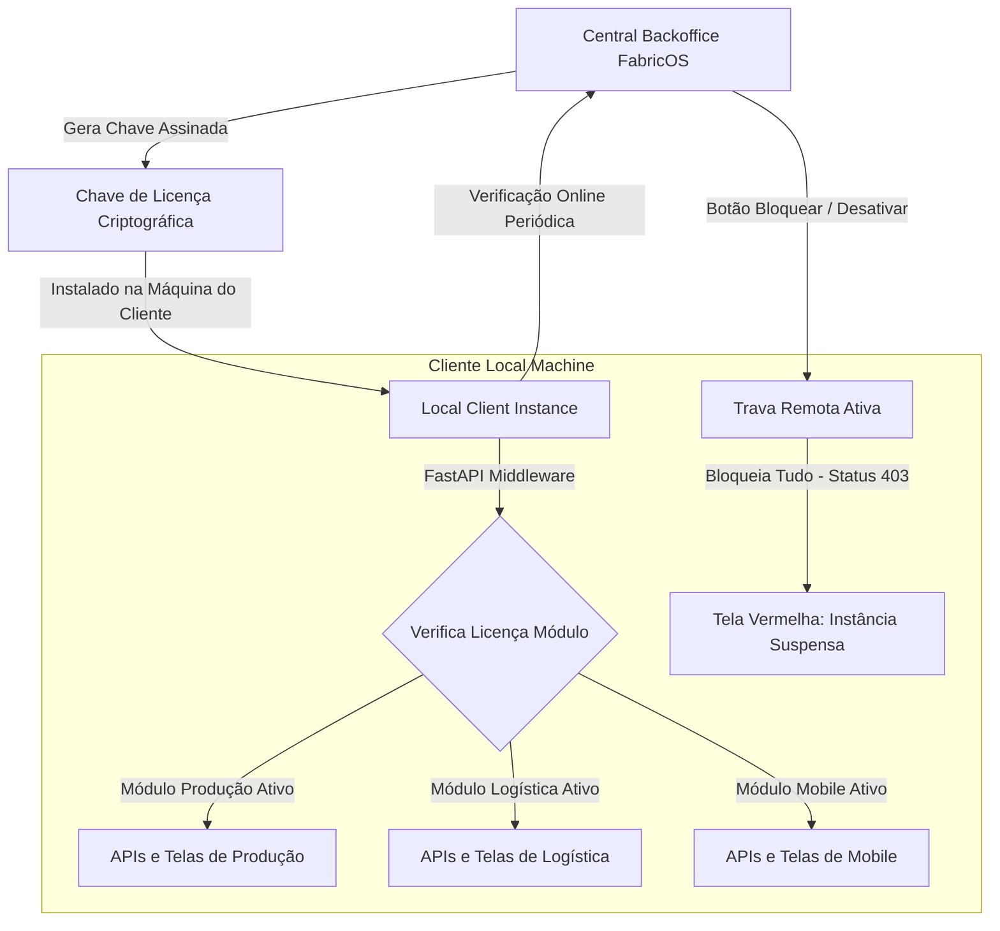

# Plano de Implementação: Fase 8 - Separação por Módulos Licenciados, Proteção contra Cópia (IP) e Backoffice com Trava Remota (Kill-Switch)

Este plano descreve a arquitetura de **licenciamento comercial**, **modularização setorial**, **proteção contra furto de código** e o **Backoffice centralizado** com **trava remota (kill-switch)** para a distribuição segura do FabricOS.

---

## 🛠️ Arquitetura do Sistema de Licenciamento

Para viabilizar a venda fracionada dos módulos e garantir a proteção intelectual do código no servidor local do cliente, implementaremos um ecossistema composto por três camadas:

### 1. Separação de Módulos (Licenciamento Setorial)
O FabricOS passará a ter seu escopo de negócios fracionado em três módulos independentes:
1.  **Produção (`producao`):** OPs, corte, costura, controle de faccionistas, insumos/matéria-prima e reconciliação XML de NF-e.
2.  **Logística (`logistica`):** Reparto, faturamento de rotas, movimentação interna e controle de showrooms.
3.  **Mobile (`mobile`):** Acesso móvel do chão de fábrica para motoboys, estoquistas e showroom bluetooth.

*   **Chave de Licença Criptográfica (License Token):**
    *   Geramos no Backoffice um token JSON Web Signature (JWS) criptografado com nossa chave privada.
    *   Este token encapsula: `tenant_id`, `client_name`, `expires_at`, `enabled_modules: ["producao", "mobile"]` e um `hardware_fingerprint` (MAC Address + CPU ID do cliente).
    *   Como a assinatura é criptográfica, o cliente não consegue editar o arquivo de licença local sem invalidar a assinatura, impedindo fraudes!

### 2. Proteção Física contra Cópia e Furto de Código (Obscurecimento)
Para evitar que o cliente copie o código-fonte do backend Python ou frontend React:
*   **Compilação Binária do Backend (Cython / `.pyd`):**
    *   Compilaremos os módulos mais críticos do backend (regras de negócio de estoque, travas, algoritmo de conciliação) de `.py` para C usando **Cython**, e depois em bibliotecas dinâmicas nativas compiladas (**`.pyd`** no Windows).
    *   Arquivos `.pyd` são códigos de máquina binários (idênticos a DLLs de C++), o que torna a engenharia reversa do código-fonte praticamente impossível.
*   **Proteção por Criptografia de Bytecode (PyArmor):**
    *   Os scripts de inicialização do servidor local serão protegidos utilizando **PyArmor**, que criptografa os bytecodes das funções em tempo de execução e injeta um hook de integridade que impede a execução sob debuggers ou descompiladores.
*   **Empacotamento Executável (PyInstaller):**
    *   O backend será empacotado em um único executável protegido (`fabricos_server.exe`).
*   **Obscurecimento do Frontend (Vite Obfuscator):**
    *   Durante a geração do build de produção do React (`npm run build`), utilizaremos o plugin `javascript-obfuscator` para renomear todas as variáveis para nomes aleatórios hexadecimais, embaralhar strings de APIs e injetar travas contra formatação (o código para de rodar se for formatado/beautified).

### 3. Backoffice Central e Trava Remota à Distância (Kill-Switch)
*   **Sincronização Online e Tolerância Off-line:**
    *   A cada inicialização do servidor local (e depois a cada 24 horas via tarefa em segundo plano), a instância do cliente faz um ping seguro para o nosso servidor central de licenciamento (`https://backoffice.fabricos.com/api/v1/licenses/validate`).
    *   Se o ping retornar que a licença foi desativada pelo Backoffice, a instância entra em **Lockdown Local**: define uma flag persistente e criptografada `is_locked = True` no banco de dados local.
    *   **Tolerância de Rede (Grace Period):** Caso o cliente desligue a internet do servidor para tentar burlar a trava, o sistema local funcionará de forma off-line por no máximo **3 dias (72 horas)** com base no último ping de data assinada. Expirado o prazo sem ping bem-sucedido, o sistema trava automaticamente.
*   **Efeito da Trava (Bloqueio Total):**
    *   Quando bloqueado (seja por expiração, falta de ping ou comando remoto), **todas** as requisições para a API local retornam `403 Forbidden` com a mensagem: *"Instância suspensa por pendências financeiras ou expiração. Entre em contato com a FabricOS."*
    *   O frontend exibe uma tela vermelha bloqueante ininterrupta: **"FabricOS - Instância Suspensa"**, ocultando todo o sistema de produção e menus.

---

## 👥 User Review Required

> [!IMPORTANT]
> **Fluxo de Inicialização Sem Internet**
> Para o primeiro setup do cliente (instalação na máquina dele), ele precisará de conexão com a internet por alguns segundos apenas para validar a chave de licença inicial e registrar o hardware fingerprint. Após o setup, a tolerância off-line de 3 dias é ativada.
>
> **Painel do Backoffice Central**
> Desenvolveremos uma aba administrativa restrita para nós (os donos da FabricOS) permitindo:
> 1. Listar todas as máquinas clientes ativas.
> 2. Ver quais módulos cada cliente contratou.
> 3. **Botão de Trava Remota:** Bloquear/desbloquear o cliente com um clique.

---

## 🗄️ Proposed Changes

### 1. Banco de Dados Local (Cliente)
#### [NEW] [migrate_v7.py](file:///c:/Users/Roberto/Music/PASTA/Controle%20de%20retirada%20de%20pe%C3%A7as/backend/app/models/migrate_v7.py)
Criar uma tabela de configuração local da licença (`license_config`) na base SQLite para guardar a chave criptografada, o status offline e flags de bloqueio.

### 2. Backend (Middlewares e Validações de Módulos)
#### [NEW] [license_middleware.py](file:///c:/Users/Roberto/Music/PASTA/Controle%20de%20retirada%20de%20pe%C3%A7as/backend/app/core/license_middleware.py)
*   **`verify_module_license(module_name: str)`:** Dependência injetável do FastAPI que intercepta as rotas de cada setor. Decodifica o token local e verifica se o módulo solicitado está habilitado. Se não estiver, bloqueia com 403.
*   **`check_remote_kill_switch()`:** Rotina que faz o ping seguro para o nosso servidor central e, se detectar bloqueio ou estouro de prazo off-line, ativa o Lockdown Local.

#### [MODIFY] [production.py](file:///c:/Users/Roberto/Music/PASTA/Controle%20de%20retirada%20de%20pe%C3%A7as/backend/app/api/production.py) & [distributions.py](file:///c:/Users/Roberto/Music/PASTA/Controle%20de%20retirada%20de%20pe%C3%A7as/backend/app/api/distributions.py)
*   Rotas de Produção passam a depender de: `Depends(verify_module_license("producao"))`.
*   Rotas de Logística passam a depender de: `Depends(verify_module_license("logistica"))`.

### 3. Simulador de Servidor Central e Backoffice (Nosso Controle)
#### [NEW] [backoffice_server.py](file:///c:/Users/Roberto/Music/PASTA/Controle%20de%20retirada%20de%20pe%C3%A7as/backend/app/api/backoffice_server.py)
Um endpoint central simulado no nosso backend que atua como o **Servidor de Licenças Central da FabricOS**. Ele servirá para simularmos o controle das licenças à distância e o acionamento do botão de bloqueio de forma interativa.

### 4. Interface do Usuário (Frontend)

#### [NEW] [BackofficeDashboard.tsx](file:///c:/Users/Roberto/Music/PASTA/Controle%20de%20retirada%20de%20pe%C3%A7as/frontend/src/pages/BackofficeDashboard.tsx)
*   **Painel Administrativo Central da FabricOS** (nossa ferramenta de monitoramento).
*   Visualiza todos os clientes ativos, status da licença, IP/fingerprint da máquina e módulos habilitados.
*   **Botão de Ação "Desabilitar à Distância" (Kill-Switch):** Um switch luminoso vermelho neon. Ao clicar, o servidor central bloqueia aquela licença e, no próximo ping do cliente, a máquina dele entra em lockdown.

#### [NEW] [LicenseLockScreen.tsx](file:///c:/Users/Roberto/Music/PASTA/Controle%20de%20retirada%20de%20pe%C3%A7as/frontend/src/pages/LicenseLockScreen.tsx)
*   Layout vermelho escuro neon de alta fidelidade que bloqueia 100% da visualização do app se a licença estiver inválida ou suspensa pelo Backoffice. Exibe mensagens de contato com o financeiro e código de erro criptográfico.

#### [MODIFY] [App.tsx](file:///c:/Users/Roberto/Music/PASTA/Controle%20de%20retirada%20de%20pe%C3%A7as/frontend/src/App.tsx)
*   Inserir o contexto global de licença que envelopa a aplicação inteira. Se a flag `is_locked` ou licença expirada for detectada nas chamadas de API, renderiza o `LicenseLockScreen` impedindo qualquer interação com as rotas.

---

## 🧪 Plano de Verificação

### Testes Automatizados (Python E2E)
*   **Novo Script `test_licensing_killswitch.py`:**
    1.  **Módulos Habilitados:** Criar uma licença local contendo apenas `["producao"]`. Tentar acessar a API de logística (`/api/distributions/`). Deve retornar `403 Forbidden` informando falta de licenciamento do módulo.
    2.  **Acesso à Produção:** Acessar a API de produção (`/api/production/orders`). Deve autorizar normalmente.
    3.  **Burlar Off-line (Grace Period):** Simular que o cliente desconectou a internet. Alterar a data do sistema de testes em +4 dias sem ping. Validar se o sistema local entra em lockdown por timeout off-line.
    4.  **Trava Remota (Kill-Switch):** No Backoffice central, marcar a licença do cliente como `is_active = False`. Disparar a rotina de ping local. Validar que as chamadas de API locais passam a retornar imediatamente `403 Forbidden` devido à desativação remota.

### Validação Visual (Frontend)
*   Testar no navegador a renderização responsiva e o bloqueio da tela vermelha neon do `LicenseLockScreen` ao simular o clique do Kill-switch no Backoffice central.
